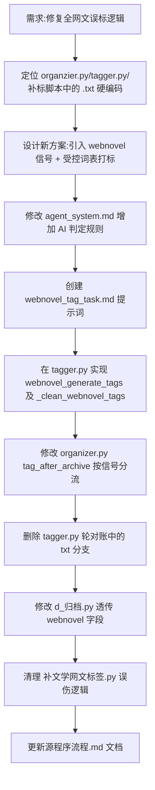

## 任务描述
修复代码中将所有 .txt 文件强制标记为"网络小说"的错误逻辑，改为由 AI 在识别阶段判定是否为网文，并在打标阶段使用受控词表进行精准打标。

## 执行过程

## 任务总结
成功消除基于文件格式的误标风险。实现了三层联动：
1. **识别层**：AI 在 final 输出中增加 `webnovel` 布尔值，依据正文证据判定。
2. **流转层**：通过 `d_归档.py` 将信号透传给归档流程。
3. **打标层**：`organizer.py` 根据信号调用 `webnovel_generate_tags`，该函数结合 `webnovel_taxonomy.json` 受控词表让 AI 打标，并由 `_clean_webnovel_tags` 进行程序侧校验过滤，确保标签合规。
