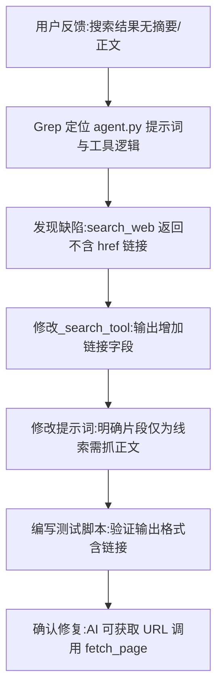

## 任务描述
修复 Agent 搜索工具链缺陷：解决 `search_web` 返回结果缺少链接导致 AI 无法调用 `fetch_page` 抓取正文的问题，并优化提示词以明确工具配合逻辑。

## 执行过程

## 任务总结
成功修复搜索工具链：
1. **数据层**：`_search_tool` 返回格式由「标题 + 片段」升级为「标题 + 片段 + 链接」，确保 AI 拥有跳转 URL。
2. **指令层**：提示词明确 `search_web` 为线索收集，`fetch_page` 为正文核验，指导 AI 在片段不足时主动使用链接抓取权威源（如豆瓣）。
3. **效果**：闭环了「搜索->判断->抓取->分类」的 Agent 工作流，避免 AI 因信息缺失而误判。
