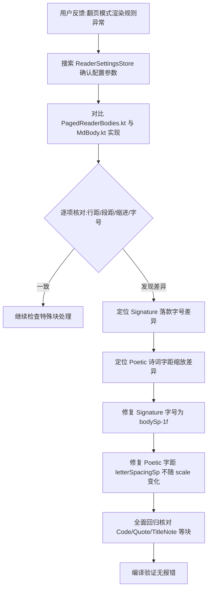

## 任务描述
修复 Android 阅读模块中翻页模式与滚动模式排版渲染不一致的问题，确保行间距、段间距、首行缩进及字号处理逻辑完全统一。

## 执行过程

## 任务总结
成功修复翻页模式渲染差异：
1. **Signature 落款**：修正字号从 `bodySp` 改为 `bodySp - 1f`，与滚动模式保持一致。
2. **Poetic 诗词**：移除字距随行宽缩放 (`letterSpacingSp * scale`) 的逻辑，保持固定字距。
3. **其他块**：确认 Quote、Code、TitleNote 等背景与字号处理均与滚动模式一致。
所有排版参数（行距 ratio、段距 sp、缩进 em）均正确读取自 `settings`，无硬编码差异。
