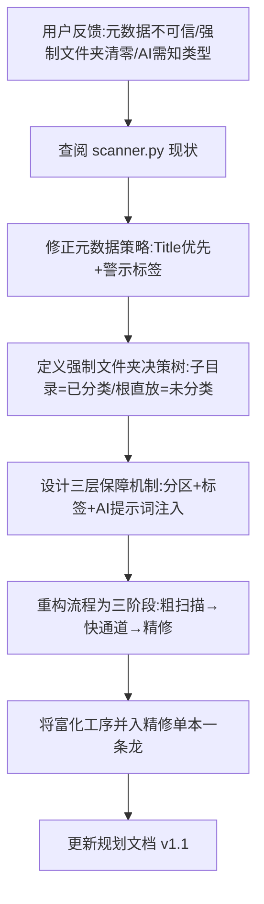

## 任务描述
根据用户反馈修订‘先发布后分类’系统规划，解决元数据信任、强制文件夹分类保留及 AI 处理逻辑问题，确立三阶段流程。

## 执行过程

## 任务总结
成功修订规划文档：
1. **元数据策略**：内嵌 Title/Author 进快通道书名（清洗软件名前缀），由「未校对」标签兜底警示；
2. **强制文件夹**：根直放视为“类型已知未分类”，子目录视为“已分类”，类型信息通过分区+标签+AI提示词三重保障，防止被清零；
3. **流程优化**：确立“粗扫描→快通道发布→精修（含细分类/元数据/富化）”三阶段，富化依赖编号结果，并入精修单本内联，避免多轮 IO。
