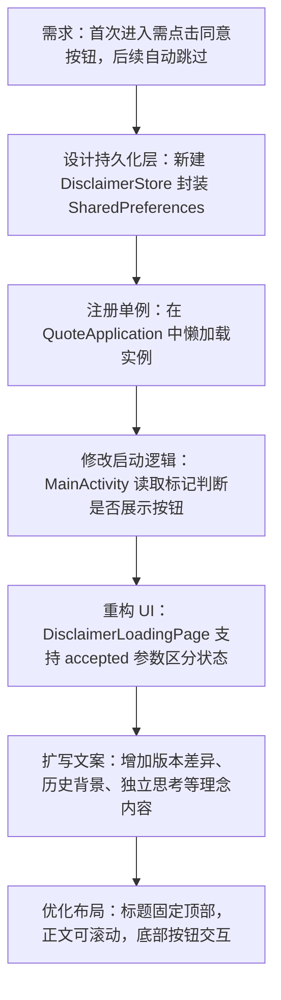

## 任务描述
为应用启动页添加免责声明强制同意机制，并扩写核心理念文案。

## 执行过程

## 任务总结
实现免责声明的强制同意流程：首次安装显示「同意并进入」按钮，点击后调用 `markAccepted()` 落盘至 SharedPreferences；后续启动自动检测标记，若已同意则仅展示加载提示并自动跳转。同时丰富了文案，强调「一字之差，义理万别」及独立思考的核心理念，提升用户认知。
