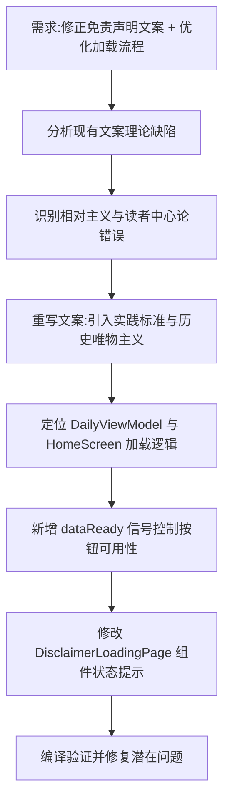

## 任务描述
修正免责声明文案中的理论错误（如相对主义、读者中心论），使其符合马克思主义立场；同时优化启动页加载流程，确保用户仅在内容就绪后才能点击同意。

## 执行过程

## 任务总结
成功修正免责声明文案：将“版本无绝对权威”改为“经考证与实践检验”，将“意义依附于读者”改为“由历史条件决定并在实践中发展”，补充“取其精华去其糟粕”。同时实现加载流程优化：首次进入时按钮在数据未就绪前置灰不可点，已同意用户需等待数据就绪后自动切入，避免用户困惑。
