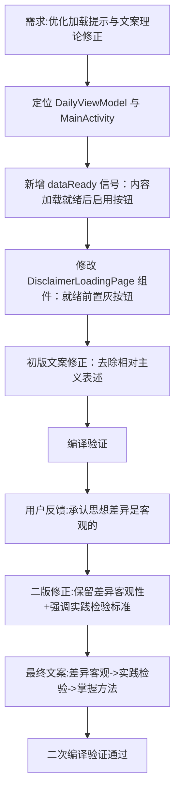

## 任务描述
优化免责声明页面交互体验（加载就绪前禁用按钮），并按马克思主义理论修正文案中的相对主义与教条主义错误。

## 执行过程

## 任务总结
成功实现加载就绪前禁用「同意并进入」按钮，避免用户误操作。文案修正经历两轮迭代：初版过度修正导致丢失合理含义，二版在承认思想差异客观性（社会存在决定社会意识）的基础上，补充了实践检验标准（区分对错），最终形成「差异客观但需实践检验」的辩证表述，避免了相对主义与教条主义。
