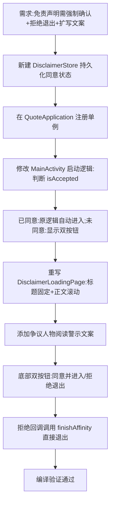

## 任务描述
重构应用启动页免责声明：实现首次进入强制点击确认、提供拒绝退出权利、扩写辩证阅读理念文案。

## 执行过程

## 任务总结
成功实现免责声明升级：新建 `DisclaimerStore` 持久化用户同意状态；首次启动显示「同意并进入」与「拒绝退出」双按钮，拒绝则直接退出且不记录状态；已同意用户自动跳过按钮。文案扩写五段，强调版本差异、历史背景、辩证批判阅读争议人物、反对教条主义及锻炼思想能力。布局采用标题固定、正文滚动适配小屏，风格保持项目规范。
