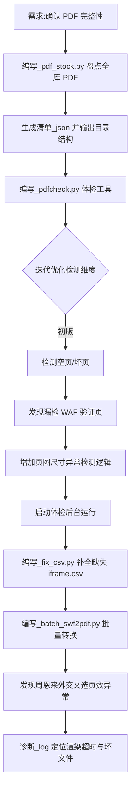

## 任务描述
对全库电子书进行完整性体检与批量转换：先盘点所有 PDF 并生成清单，再编写自动化工具逐页检测空页、坏页及疑似 WAF 验证页（尺寸异常），最后将 SWF 源文件批量转换为 PDF，并处理转换中的超时与坏文件问题。

## 执行过程

## 任务总结
成功实现全库 PDF 自动化管理：
1. **盘点**：识别全库 183 个 PDF，生成结构化清单。
2. **体检**：开发多维度体检脚本，通过低分辨率渲染查空页、读取异常查坏页、宽度偏离中位数查 WAF 假页，支持有源目录书的页数比对。
3. **转换**：批量串行转换 SWF 为 PDF，具备断点续传、坏文件自动剔除功能；针对转换超时问题，通过日志分析定位到 Playwright 连接拒绝与 Timeout 原因，为后续修复提供依据。
4. **修补**：自动补全被校验误拦的 2 字节系统文件 iframe.csv。
