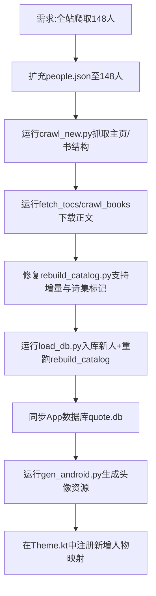

## 任务描述
将马克思列宁主义文库网站的人物数据从 58 人扩充至 148 人，完成全站爬取、去重、诗集标记及 App 端头像资源的全量更新。

## 执行过程

## 任务总结
成功完成 148 人全量数据入库（709 本书、16446 条目）。App 端通过 `gen_android.py` 自动生成 147 个头像资源，并在 `Theme.kt` 的 `StylePresets.byKey` 中注册了所有新增人物的样式映射，实现了全自动化的数据同步流程。
