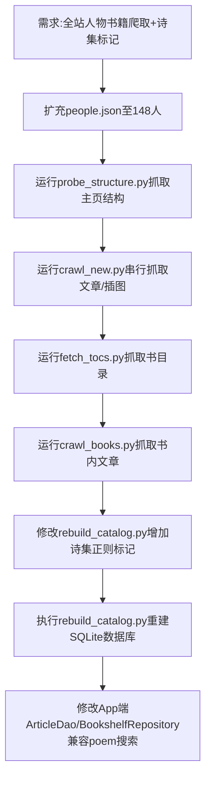

## 任务描述
对马克思在线图书馆进行全站人物书籍爬取，并实现诗集自动标记与数据库重建。

## 执行过程

## 任务总结
1. 完成148位人物的主页结构、文章、插图及290本著作的爬取。
2. 在rebuild_catalog.py中引入POETRY_RX正则，将整本诗集文章的kind标记为'poem'。
3. App端搜索逻辑适配，支持按source检索时包含poem类型文章。
4. 所有脚本增加了maozedong/luxun/editor等手工库人物的跳过保护。
