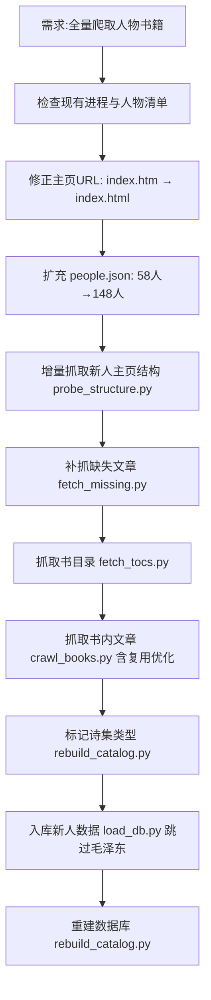

## 任务描述
全量爬取马克思主义文献网（marxists.org/chinese）所有人物主页及书籍文章，区分诗集类型，排除手工维护库（如毛泽东），最终同步至本地数据库。

## 执行过程

## 任务总结
成功完成 148 人全量爬取：头像齐全、主页文章 5410 篇、书目录 123 本、书内文章 2553 篇（复用优化节省时间）、诗集标记逻辑就绪（全站无诗集书）。修复关键 bug：URL 变更、增量加载覆盖、重复下载、手工库跳过保护。最终 DB 新增 383 本书、6130 篇文章（非手工库），仅 4 篇缺失兜底入库。
