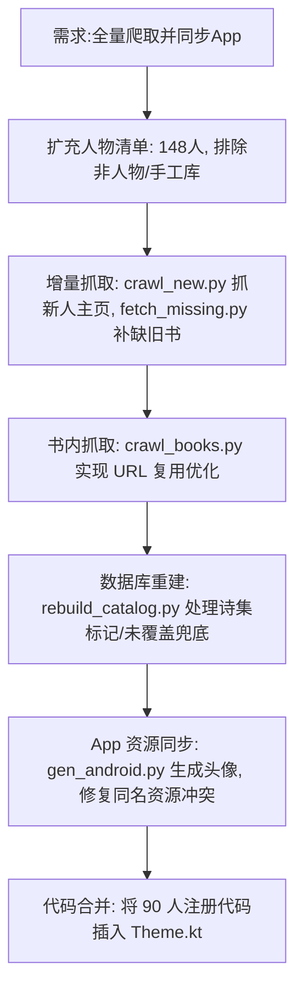

## 任务描述
对马克思在线图书馆进行全量爬取（含新增 90 人），整理书籍目录，更新 SQLite 数据库，并将所有人物头像及注册代码同步至 Android App。

## 执行过程

## 任务总结
1. **数据层**: 扩充 `people.json` 至 148 人；爬取 5410 篇主页文章 + 2553 篇书内文章；DB 最终包含 150 人、709 本书、16446 目录条目。
2. **爬虫优化**: 在 `crawl_books.py` 中增加 URL 复用逻辑，避免重复下载；所有脚本增加 `maozedong` 跳过保护。
3. **App 层**: 解决 Android 资源命名冲突（如 `avatar_engels.png` vs `.gif`）；成功将 90 个新人物注册到 `StylePresets`。
