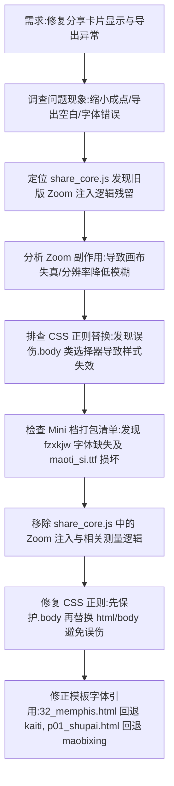

## 任务描述
修复分享卡片在 WebView 中显示异常的问题：卡片被缩成一点、导出图片包含多余透明空白区域、Mini 档位下字体与字色错误。

## 执行过程

## 任务总结
成功解决分享卡片三大问题：
1. 移除 share_core.js 中导致卡片缩小的 CSS zoom 注入逻辑，恢复 1:1 自然渲染，消除导出时的透明空白与模糊。
2. 修复 CSS 样式提取正则，采用“先保护 .body 后替换 body”策略，防止 .body 类选择器被破坏导致字色/字号丢失。
3. 修正 Mini 档位下的字体回退方案：将引用缺失字体 fzxkjw 的模板改为楷体，损坏的 maoti_si.ttf 改为毛体行书，确保三档全量可用。
