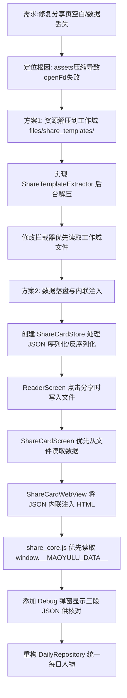

## 任务描述
解决分享卡片页面空白及数据传递失败问题，并实现数据落盘与Debug功能。

## 执行过程

## 任务总结
成功修复分享页问题：
1. **资源加载**：实现 `ShareTemplateExtractor` 将模板资源解压至应用私有目录，避免 APK 压缩导致的 `openFd` 失败；拦截器改为优先读取工作域文件。
2. **数据传递**：采用「落盘+内联」双重保障。阅读页点击分享时将数据写入 JSON 文件；分享页启动时优先从文件读取，并通过 `injectPayload` 将 JSON 直接注入 HTML 末尾 (`window.__MAOYULU_DATA__`)，彻底绕过 JS Bridge。
3. **Debug支持**：在切换模板时弹出 Dialog，展示「落盘原文」、「反序列化对象」、「注入模板数据」三段 JSON，便于排查数据不一致问题。
4. **业务逻辑**：重构 `DailyRepository`，确保语录、诗词、文章均基于同一位「今日人物」选取。
