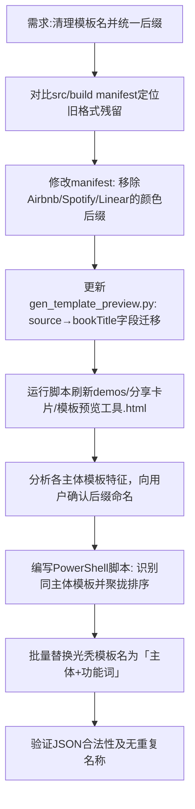

## 任务描述
重构分享卡片模板命名体系：清理冗余颜色后缀，确立「同主体多模板必须带功能后缀」规则，并对清单进行分组排序。

## 执行过程

## 任务总结
完成模板命名规范化：
1. 移除旧版「· 颜色」后缀，统一为功能区分（如 Airbnb 民宿、Spotify 歌手）。
2. 修复预览工具脚本的数据源映射（source → bookTitle）。
3. 实现同主体模板在 manifest 中物理相邻排序，提升用户体验。
4. 涉及主体包括 Apple(分享)、Spotify(歌词)、Linear(摘录)、Google(搜索) 等。
