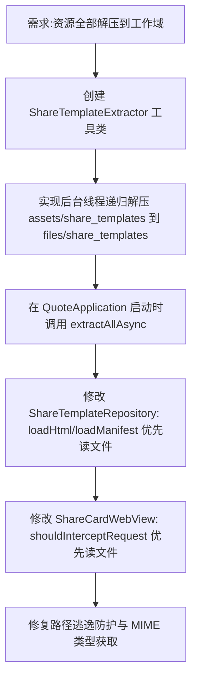

## 任务描述
解决 Android WebView 中 openFd 读取 APK assets 失败的问题，实现分享模板资源（HTML/JS/CSS）从 assets 流改为解压到 files 目录（工作域）后读取。

## 执行过程

## 任务总结
1. 新增 `ShareTemplateExtractor` 对象，实现增量解压与半文件防护。
2. 在 `QuoteApplication` 初始化阶段异步触发解压。
3. `ShareTemplateRepository` 与 `ShareCardWebView` 均改为「工作域文件优先，assets 兜底」策略。
4. 解决了因 APK 压缩导致 `openFd` 失败及缓存旧版 JS 的问题。
