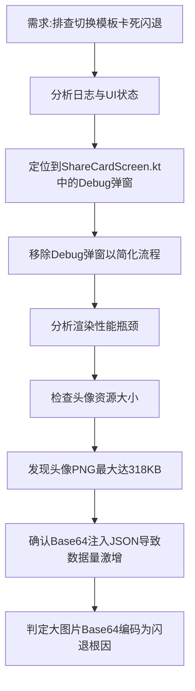

## 任务描述
排查并修复切换模板时应用卡死、闪退的问题。

## 执行过程

```mermaid
graph TD
    A[需求:排查切换模板卡死闪退] --> B[分析日志与UI状态]
    B --> C[定位到ShareCardScreen.kt中的Debug弹窗]
    C --> D[移除Debug弹窗以简化流程]
    D --> E[分析渲染性能瓶颈]
    E --> F[检查头像资源大小]
    F --> G[发现头像PNG最大达318KB]
    G --> H[确认Base64注入JSON导致数据量激增]
    H --> I[判定大图片Base64编码为闪退根因]
```

## 任务总结
移除了ShareCardScreen.kt中的Debug弹窗。经排查，切换模板卡死闪退的根因是头像资源过大（最大318KB PNG），在通过Base64注入JSON数据时导致内存占用激增或解析超时。后续需优化头像压缩或采用URI引用方式。
