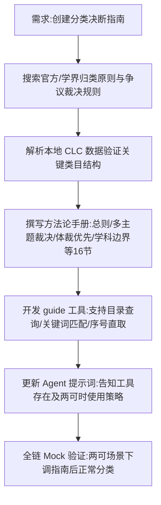

## 任务描述
为图书分类 Agent 创建本地《分类决断指南》，解决 AI 在两可归属时的决断问题。提供方法论而非穷举案例，通过 guide 工具按需检索。

## 执行过程

## 任务总结
成功创建 `resources/classify_guide.md` 包含官方依据、馆级规范及示范案例；在 `agent.py` 新增 `guide` 工具实现按需检索；更新 `skills/agent_system.md` 提示词。验证显示 AI 可在两可时先查指南再联网，有效减少无效搜索并提高决断准确性。
