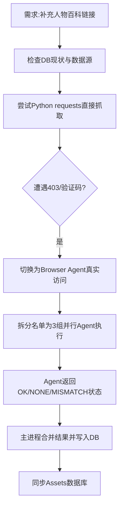

## 任务描述
为项目数据库中约150位历史人物批量补充百度百科链接。

## 执行过程

```mermaid
graph TD
    A[需求:补充人物百科链接] --> B[检查DB现状与数据源]
    B --> C[尝试Python requests直接抓取]
    C --> D{遭遇403/验证码?}
    D -- 是 --> E[切换为Browser Agent真实访问]
    E --> F[拆分名单为3组并行Agent执行]
    F --> G[Agent返回OK/NONE/MISMATCH状态]
    G --> H[主进程合并结果并写入DB]
    H --> I[同步Assets数据库]
```

## 任务总结
成功通过浏览器Agent绕过反爬机制，确认了57人的有效百科链接并入库。对于无词条或存在同名异人歧义的人物保持空白，未强行填充。
