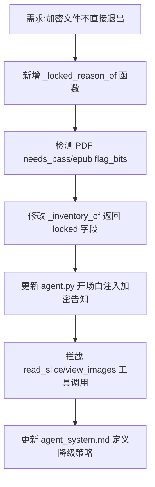

## 任务描述
实现图书编目 Agent 对加密文件的分级处理：程序检测加密状态并告知 AI，AI 放弃读取正文，改为通过文件名+联网搜索确认身份并完成分类。

## 执行过程

## 任务总结
成功实现加密文件降级流程：
1. **程序层**：识别 PDF/EPUB 加密特征，在 inventory 中标记 locked 原因。
2. **Agent 层**：开场白明确告知正文不可读；拦截试读类工具调用，强制引导使用 search_web/book_api 等外部证据。
3. **规则层**：定义“加密≠干不了”，明确凭文件名查证的标准操作路径。
