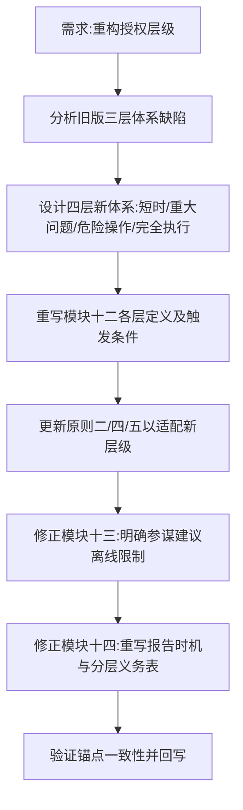

## 任务描述
重构协作协议中的授权层级体系，将原有的三层授权升级为四层体系（短时任务、长任务重大问题报告、长任务危险操作报告、完全执行），并同步修正模块十二至十四的相关逻辑。

## 执行过程

## 任务总结
成功实现四层授权体系：
1. **第二层**：长任务重大问题报告，强调每一个重大裁决均需汇报。
2. **第三层**：长任务危险操作报告，规划内重大裁决自主，不在规划内的部署/删除等危险操作不做，先做完其他统一汇报。
3. **第四层**：完全执行，agent允许的操作直接决定，可违背具体规定但不得改变规划精神，禁区是不改规划文本和基本路线。
4. **关联修正**：模块十三明确第三四层离线时不得利用参谋程序反对规划；模块十四同步更新报告时机表。
