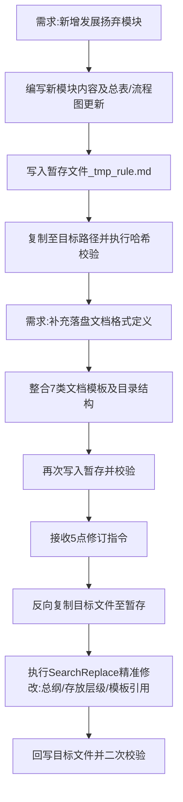

## 任务描述
为协同工作规程新增“发展扬弃”认识论模块，补充完整的落盘文档格式定义（含7类文档模板），并根据用户反馈进行多轮迭代修订。

## 执行过程

## 任务总结
成功将规则文件扩展至12模块完整版。关键变更包括：
1. **新增模块十一**：确立过去不可变、现在必须变、变化分级等原则。
2. **完善文档体系**：定义了docs/下的7类目录结构及详细Markdown模板。
3. **优化存储策略**：区分项目级与全局级（~/.qoder/docs/）文档存放路径。
4. **流程标准化**：确立了“暂存编辑->复制落盘->哈希校验”的防篡改发布流程。
