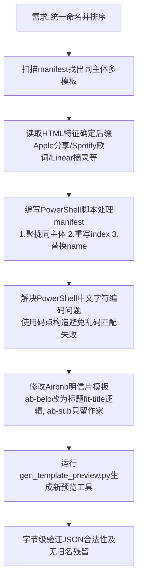

## 任务描述
统一品牌类模板命名规范：同一主体下的所有模板必须带后缀，禁止光秃秃的主体名；同时按主体分组排序。

## 执行过程

```mermaid
graph TD
    A[需求:统一命名并排序] --> B[扫描manifest找出同主体多模板]
    B --> C[读取HTML特征确定后缀<br/>Apple分享/Spotify歌词/Linear摘录等]
    C --> D[编写PowerShell脚本处理manifest<br/>1.聚拢同主体 2.重写index 3.替换name]
    D --> E[解决PowerShell中文字符编码问题<br/>使用码点构造避免乱码匹配失败]
    E --> F[修改Airbnb明信片模板<br/>ab-belo改为标题fit-title逻辑, ab-sub只留作家]
    F --> G[运行gen_template_preview.py生成新预览工具]
    G --> H[字节级验证JSON合法性及无旧名残留]
```

## 任务总结
成功实现7个光秃模板补全后缀（如Apple分享、Spotify歌词），Manifest按主体相邻排序（共100个模板），修正Airbnb模板布局以适配标题自适应，并刷新预览工具。
