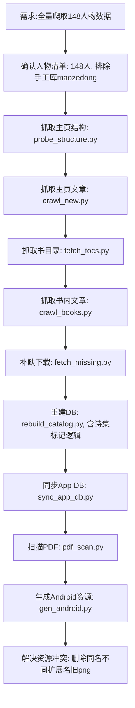

## 任务描述
从马克思在线图书馆爬取148位人物的书籍、文章、头像等资源，整理并同步至Android App数据库。

## 执行过程

## 任务总结
成功完成148人数据爬取与入库：
1. 数据量：150人（147爬虫+3手工库），14228篇文章，709本书，16446目录条目。
2. 脚本优化：所有爬虫脚本增加`SKIP={'maozedong'}`保护，避免覆盖手工库；增加限流间隔（1.5s）和并发控制。
3. 资源处理：gen_android.py生成147个头像，解决aapt2同名不同扩展名冲突（删除旧png保留新jpg/gif）。
4. 诗集标记：rebuild_catalog.py实现POETRY_RX正则匹配，全站实际无诗集类型书，逻辑就绪。
