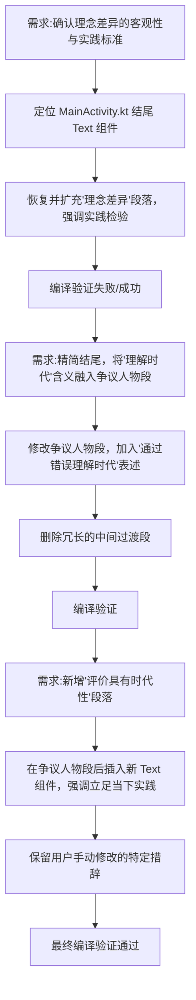

## 任务描述
针对哲学小测试应用的结尾及争议人物介绍文本进行多轮迭代修改，构建完整的认识论逻辑链条。

## 执行过程

## 任务总结
成功重构应用文本逻辑：
1. **结尾段**：精简为掌握立场方法、反对教条主义。
2. **争议人物段**：明确'理念不代表正确'，强调通过了解错误理解时代以对应当下。
3. **新增段**：补充'评价具有时代性'，提出立足当下实践、总结新理论的要求。
所有修改均经过 Gradle 编译验证通过，保留了用户指定的关键措辞。
