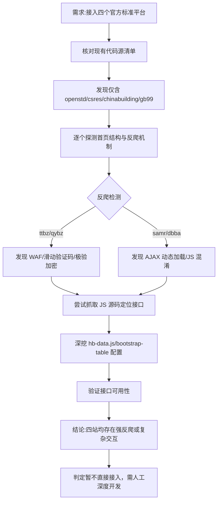

## 任务描述
评估并尝试接入四个官方标准平台（团标 ttbz.org.cn、地标 dbba.sacinfo.org.cn、行标 std.samr.gov.cn/hb、企标 qybz.org.cn）作为标准查询数据源。

## 执行过程

## 任务总结
完成四个官方平台的深度技术调研：
1. **反爬特征库建立**：ttbz 有 WAF 拦截；qybz 使用极验验证码+SM2 加密；samr 和 dbba 依赖复杂的 AJAX 动态加载。
2. **接口挖掘**：发现 samr 详情页模式 `/hb/search/stdHBDetailed?id=<id>`，dbba 列表接口 `/stdQueryList`，但均无简单直连查询 URL。
3. **决策**：因验证码和动态渲染导致自动化解析成本极高，判定这四个平台无法像 gb99.cn 那样快速接入，建议保留为人工备选或后续专项开发。
4. **价值**：建立了针对政府/行业类标准网站的反爬特征识别经验，避免后续重复无效尝试。
