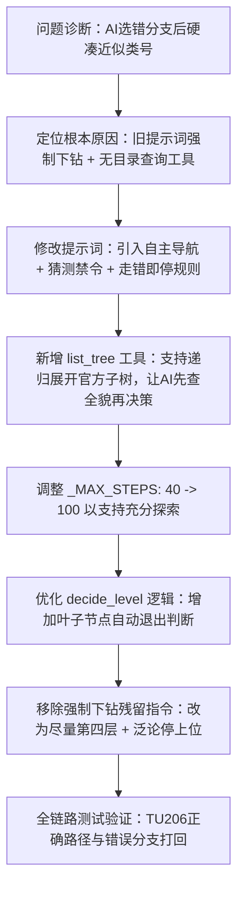

## 任务描述
重构图书自动分类Agent的逻辑，解决AI在错误分类路径下无法回退、强行钻入无效层级、以及缺乏目录全局视野的问题。

## 执行过程

## 任务总结
成功实施分类逻辑重构：
1. **新工具**：新增 `list_tree` 工具，支持不带参数列一级大类或指定类号展开子树（deep<=3），让AI能一眼确认类号是否存在及含义。
2. **提示词升级**：废除“绝不允许停在还有子类目的层级”，改为“猜测禁令”（无证据不硬定）、“有证据先验证”（CIP号需list_tree查证）、“发现走错立即停”（错误分支直接留人工）。
3. **流程优化**：`decide_level` 增加叶子节点自动结束逻辑（无子目直接返回final），默认目标设为“尽量下钻到第四层”。
4. **结果**：实测《建筑设计资料集》可正确归入 TU206，错误路径（如TU242）被即时打回，不再出现乱选近似类号的情况。
