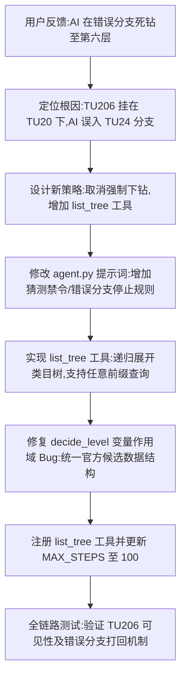

## 任务描述
解决图书自动分类 AI 在错误分支中死钻、无法回退的问题，将"强制逐层下钻"模式重构为"自主导航 + 目录查询"模式。

## 执行过程

## 任务总结
成功重构分类逻辑：
1. **提示词升级**：明确禁止无证据猜测，规定发现走错分支必须停止并留人工，而非硬凑近似值。
2. **工具增强**：新增 `list_tree` 工具，支持按前缀（如 TU2）展开子树，让 AI 能先确认类目存在性再决策。
3. **逻辑修复**：修正 `decide_level` 中 `cands` 未定义的错误，确保实时校验准确。
4. **配置调整**：最大动作轮数提升至 100，支持充分探索。
测试验证显示，AI 现在能通过 `list_tree TU2 deep=2` 直接看到 TU206，并在误入 TU24 时正确拒绝。
