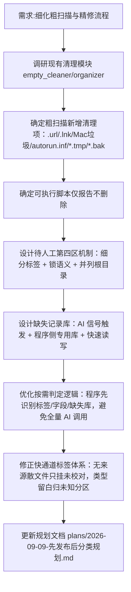

## 任务描述
更新图书分类系统 v1.2 规划，明确粗扫描清理规则、待人工机制、缺失记录库设计及按需判定逻辑。

## 执行过程

## 任务总结
成功更新系统规划 v1.2：
1. **粗扫描清理**：新增散落 .url/.lnk、Mac 垃圾、autorun.inf、*.tmp/*.bak 的直接删除；可执行脚本仅报告；保留下载残留不动。
2. **待人工机制**：设立书库根下第四区「待人工」，细分标签（待分类/富化/校对），进入即锁定自动流程。
3. **缺失记录库**：AI 无法找到时输出信号，程序写入同目录专用库，用于区分"未做"与"确认无"。
4. **按需判定**：程序通过标签/字段/缺失库三项比对决定小阶段，避免百万级数据全量 AI 判断。
5. **标签修正**：无来源散文件仅挂「未校对」，类型留白归"未知"分区，精修后补正式标签。
