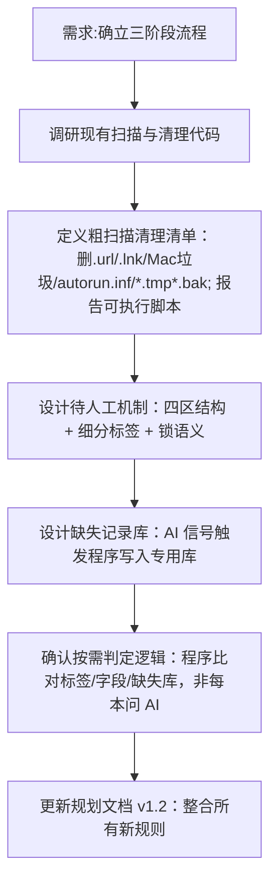

## 任务描述
重构图书管理系统处理流程为三阶段（粗扫描→快通道发布→精修），明确粗扫描清理规则、待人工机制及按需判定逻辑。

## 执行过程

## 任务总结
成功制定 v1.2 版规划：
1. **粗扫描**：新增散落 .url/.lnk、Mac 垃圾、autorun.inf、*.tmp/*.bak 自动删除；可执行脚本只报告不删除。
2. **待人工**：书库根新增第四区，挂「待分类/待富化/待校对」细分标签，进入即锁定跳过自动流程。
3. **缺失记录库**：程序侧专用库，记录 AI 无法找到的元数据，避免重复搜索和误挂标签。
4. **按需判定**：通过程序比对标签、字段值、缺失库决定小阶段，无需全量调用 AI。
