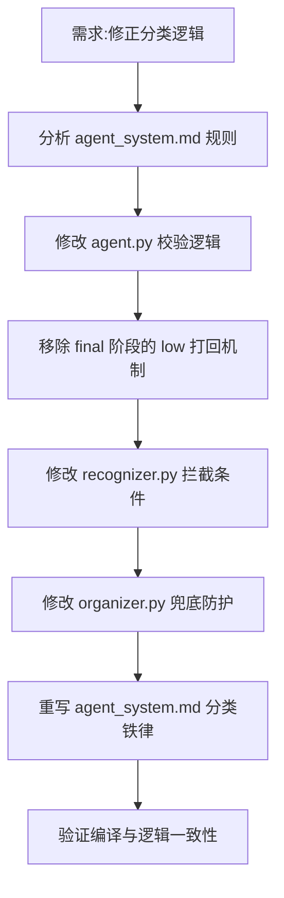

## 任务描述
修正图书编目Agent的分类逻辑，解决"无CIP分类号即判定为low并留人工"的错误行为，确立"按内容实质自主分类"的核心原则。

## 执行过程

## 任务总结
1. **语义修正**：明确 `confidence` 仅表示元数据（书名/作者等）的身份确认程度，不再作为分类完成的阻碍。
2. **自主分类**：在 `agent_system.md` 中规定，无CIP/现成证据是常态，AI必须根据正文、目录、书籍结构进行实质归类，禁止因无证据而放弃分类。
3. **逻辑变更**：
   - `agent.py`: 移除 `_LOW_MAX_TRIES` 和 low 状态打回循环；`final` 校验只关注分类路径合法性与深度，low 照常归档。
   - `recognizer.py` & `organizer.py`: 拦截条件从 `confidence==low OR title缺失` 简化为仅 `title缺失`。Low 置信度的书若书名已确认，照常入库归档。
4. **人工介入**：仅当 AI 显式输出 `manual` 动作或书名完全无法确认时，才留给人工处理。
