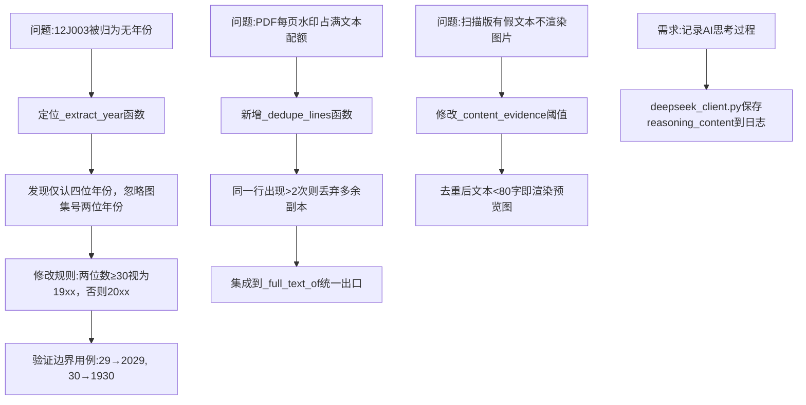

## 任务描述
修复国标图集年份提取逻辑（两位年份≥30视为19xx），并实现PDF重复行清洗以过滤推广水印，同时优化扫描版PDF识别策略（文本不足时渲染预览图）。

## 执行过程

## 任务总结
成功修复图集年份识别：将两位年份判定规则从≥80调整为≥30（覆盖1930-2029范围）；新增_dedupe_lines函数在文本提取源头过滤重复水印行；调整扫描版PDF识别策略，去重后文本不足80字自动渲染预览图；记录DeepSeek思考过程至日志。所有修改经单元测试验证通过。
