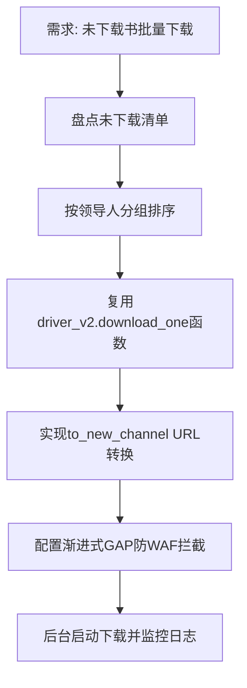

## 任务描述
对839本未下载图书按领导人优先级（毛>周>朱>邓>江>胡>刘）进行批量下载。

## 执行过程

```mermaid
graph TD
    A[需求: 未下载书批量下载] --> B[盘点未下载清单]
    B --> C[按领导人分组排序]
    C --> D[复用driver_v2.download_one函数]
    D --> E[实现to_new_channel URL转换]
    E --> F[配置渐进式GAP防WAF拦截]
    F --> G[后台启动下载并监控日志]
```

## 任务总结
构建了基于优先级的批量下载方案。关键经验：直接复用成熟驱动模块（driver_v2），通过注入URL转换层适配新域名，并使用动态GAP策略应对WAF限制。连续失败自动停止机制防止无效请求。
