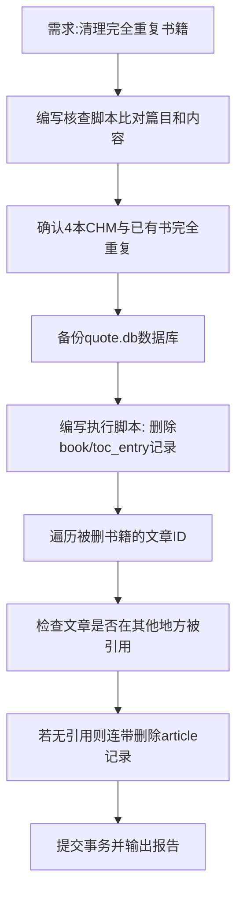

## 任务描述
根据内容比对结果，清理数据库中完全重复的CHM书籍，并保留唯一版本。

## 执行过程

```mermaid
graph TD
    A[需求:清理完全重复书籍] --> B[编写核查脚本比对篇目和内容]
    B --> C[确认4本CHM与已有书完全重复]
    C --> D[备份quote.db数据库]
    D --> E[编写执行脚本: 删除book/toc_entry记录]
    E --> F[遍历被删书籍的文章ID]
    F --> G[检查文章是否在其他地方被引用]
    G --> H[若无引用则连带删除article记录]
    H --> I[提交事务并输出报告]
```

## 任务总结
成功删除4本完全重复的CHM书籍（巴布石金、伊罗生、布雷弗曼、密利本德各一本）。执行过程中先备份数据库，再通过SQL查询确保只删除无引用的孤儿文章，避免了数据丢失风险。
