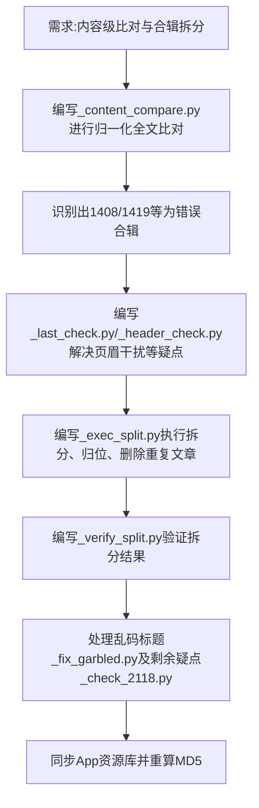

## 任务描述
根据用户要求，对书籍进行内容级比对（去除格式、标点、空白后逐字对比）。若书A包含书B的所有篇目且内容完全一致，则只保留篇数最多的书；若存在残缺，也需按此规则处理。同时处理CHM合辑拆分、乱码标题修复及重复文章删除。

## 执行过程

## 任务总结
成功拆散1408(马克思)和1419(恩格斯)的错误CHM合辑，恢复原书名，删除内容完全一致的重复文章（如7595/7596/12346），修正目录顺序，并处理了部分乱码标题。
