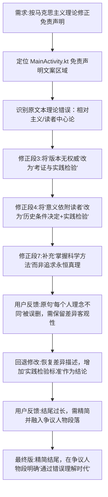

## 任务描述
修正免责声明文案的理论表述，确保符合马克思主义立场（实践论、辩证法），避免相对主义和教条主义，并根据用户反馈迭代优化。

## 执行过程

## 任务总结
成功修正免责声明文案：
1. **理论纠偏**：将原文本中滑向相对主义的表述（如'没有绝对权威'、'意义依附读者'）修正为马克思主义的实践观（'真伪优劣经实践检验'、'意义由历史条件决定并在实践中发展'）。
2. **辩证统一**：在承认思想差异客观性的同时，强调'差异不等于无对错'，确立'实践'为检验标准。
3. **迭代优化**：根据用户反馈，保留'理念差异'的客观描述，将其融入'争议人物'段落，明确'通过了解错误理解时代'的辩证阅读观，并精简结尾段落。
