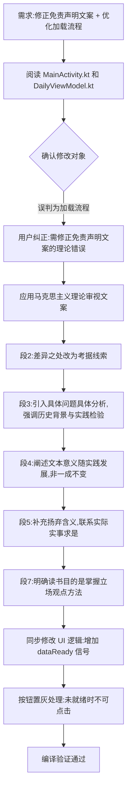

## 任务描述
根据马克思主义理论修正免责声明文案，避免相对主义和教条主义，同时优化启动页加载流程，确保用户仅在数据就绪后点击同意按钮。

## 执行过程

## 任务总结
成功修正免责声明文案，将原文中模糊的相对主义表述转化为马克思主义认识论表述（具体问题具体分析、历史唯物主义、实践检验真理、扬弃）。同时优化启动页交互，通过收集 DailyViewModel 的 isLoading 状态，在数据加载完成前禁用「同意并进入」按钮，防止用户误操作，提升用户体验。
