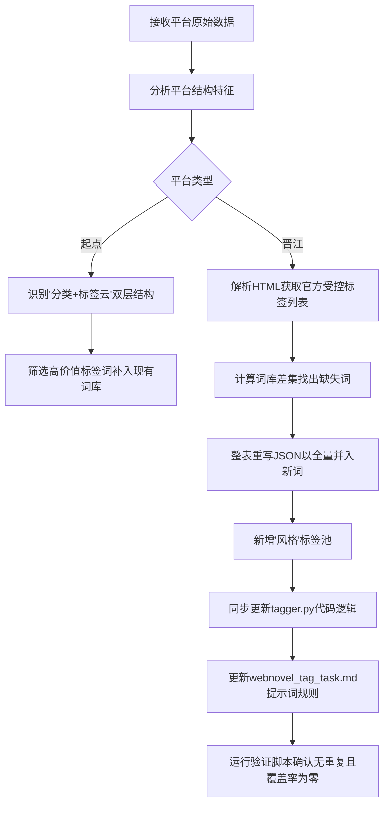

## 任务描述
基于起点和晋江等主流小说平台的公开数据结构，扩充和完善内部网文标签词库（webnovel_taxonomy.json），确保覆盖各平台的核心标签。

## 执行过程

## 任务总结
成功完成词库 v4.0 升级：
1. 引入起点标签（如豪门、废材流）和晋江 279 个官方标签（含具体 IP 名、ABO/哨向等特色设定）。
2. 新增'风格'标签池，实现五池自由组合。
3. 修正打标程序 tagger.py 以支持新池结构，更新提示词文档。
4. 验证结果：词库总计 541 词，晋江标签覆盖率达 100%（除非文学类 app 词），无重复词。
