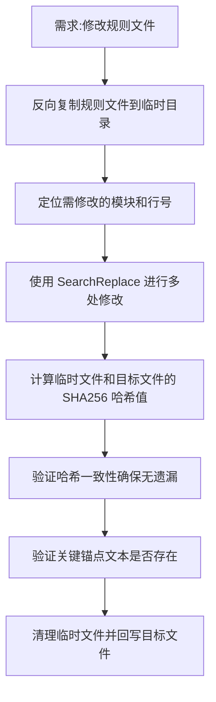

## 任务描述
对《革命性协作协议》等大型 Markdown 规则文件进行多轮迭代修改，包括新增模块、修正逻辑冲突、补充事实定义。

## 执行过程

```mermaid
graph TD
    A[需求:修改规则文件] --> B[反向复制规则文件到临时目录]
    B --> C[定位需修改的模块和行号]
    C --> D[使用 SearchReplace 进行多处修改]
    D --> E[计算临时文件和目标文件的 SHA256 哈希值]
    E --> F[验证哈希一致性确保无遗漏]
    F --> G[验证关键锚点文本是否存在]
    G --> H[清理临时文件并回写目标文件]
```

## 任务总结
建立了安全的规则文件修改流程：通过反向复制、多步 SearchReplace、哈希校验和锚点验证，确保大型配置文件在多次迭代中的完整性和一致性。避免了直接编辑导致的意外覆盖或丢失。
