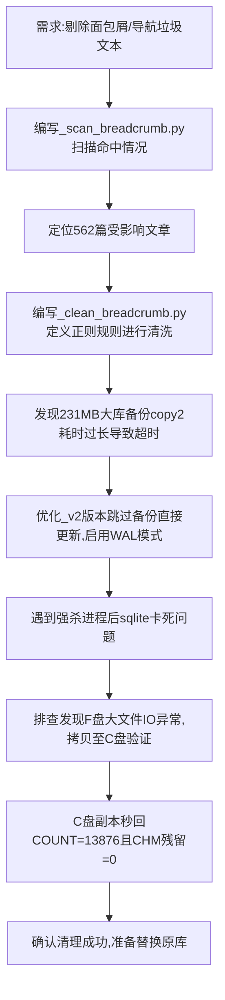

## 任务描述
批量剔除数据库中文章内容的页头面包屑、导航链接及下载信息（如CHM/PDF下载、相关链接等），同时保留正文内的引用注释。

## 执行过程

## 任务总结
成功实现面包屑清理：
1. 定义了A-F六类正则规则精准匹配导航行，不误删正文注释。
2. 解决了大库（231MB）备份导致的超时问题，采用跳过备份策略。
3. 诊断出F盘大文件读取卡顿问题，通过C盘副本验证了数据完整性与清理效果（残留为0）。
4. 最终清理了188篇文章，删除417行垃圾内容。
