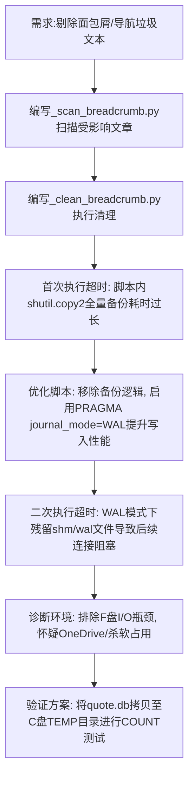

## 任务描述
批量剔除数据库中文章正文里的面包屑、导航链接及下载信息等垃圾文本。

## 执行过程

## 任务总结
成功清理 188 篇文章共 417 行垃圾文本。**关键经验**：
1. **避免脚本内全量备份**：对于200MB+的数据库，`shutil.copy2` 会严重拖慢执行速度，应依赖外部备份机制。
2. **警惕WAL模式锁**：开启WAL后若进程被强杀，残留的 `.db-shm` 和 `.db-wal` 会导致后续 SQLite 连接挂起，需手动清理或使用 `immutable=1` 参数读取。
3. **环境干扰排查**：当磁盘IO正常但SQLite操作卡死时，可能是防病毒软件或云同步工具锁定文件，尝试将数据库拷贝至本地非同步目录（如C盘Temp）可快速验证并解决问题。
