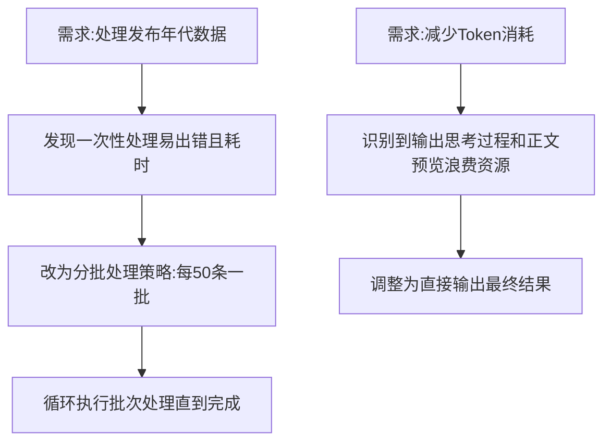

## 任务描述
优化大数据量处理流程及交互输出规范。

## 执行过程

## 任务总结
1. **分批处理机制**：在处理大量数据（如人物、语录等）时，必须采用分批策略（建议每50条为一个批次），避免单次请求过长导致超时、内存溢出或逻辑错误，同时便于定位问题。
2. **极简输出规范**：在执行代码生成、脚本编写或数据转换任务时，严禁输出思考过程、中间状态或正文预览，直接输出最终可执行的代码或结果，以节省Token并提高响应速度。
