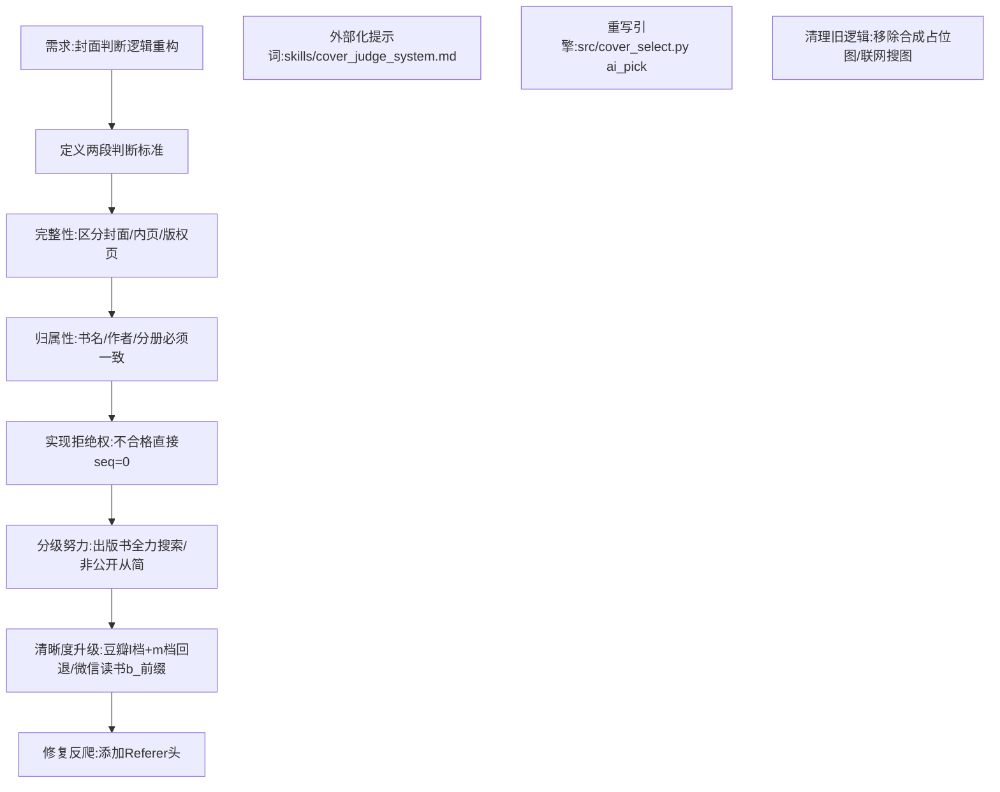

## 任务描述
重构封面判断系统，将单一的"符合度"判断拆分为"封面完整性"与"归属一致性"两段严格筛选，引入拒绝权、分级努力机制及清晰度档位升级策略。

## 执行过程

## 任务总结
成功实现封面判断 v2：废弃模糊的"符合度"，确立"完整性→归属性"两阶段过滤；新增拒绝权避免错图入库；针对出版书启用掀页/API查词，非出版书仅从候选择优；修复豆瓣/微信读书下载器，增加 Referer 防反爬及大图档位自动回退链；将提示词外部化至 skills 目录，代码动态加载。
