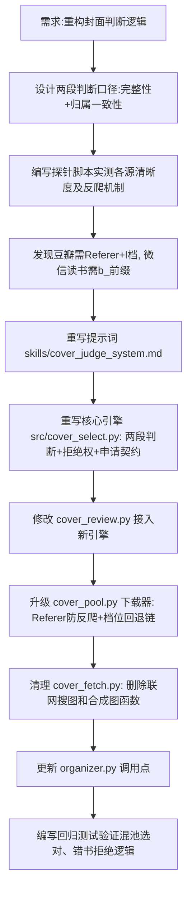

## 任务描述
重构图书封面判断逻辑，废弃模糊的"符合度"概念，改为严格的"两段判断"（封面完整性 + 归属一致性）；解决豆瓣/微信读书封面清晰度不足及反爬问题；废除联网搜图和程序合成占位图功能。

## 执行过程

## 任务总结
成功实现封面判断精细化控制：
1. **逻辑重构**：引入"封面完整性"和"归属一致性"两段判断，支持AI分级努力（出版书可申请掀页/查词，非公开出版从简）。
2. **清晰度修复**：在 cover_pool.py 中实现 URL 档位升级回退链（豆瓣 s→l/m，微信读书 s_→b_/m_）及 Referer 补全，解决反爬导致的大图获取失败。
3. **功能精简**：废除联网搜图和合成占位图，找不到合格封面时直接标记为无图，前端显示默认样式。
4. **回归验证**：通过混池测试验证了 AI 能正确区分同系列不同分册封面，并在无合格封面时行使拒绝权。
