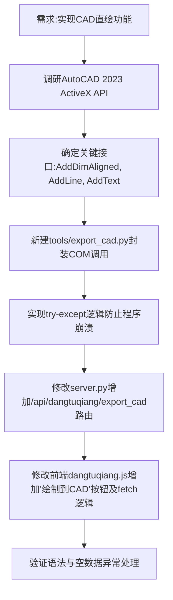

## 任务描述
为工程小工具添加通过 AutoCAD COM 接口在 CAD 中绘制挡土墙图纸的功能，替代原有的 DXF 导出方式。

## 执行过程

## 任务总结
成功实现 CAD 直绘功能：
1. **后端**：新建 `export_cad.py`，使用 `win32com.client` 连接 CAD，实现了线条、文字及内部标注组件的绘制，包含完善的异常捕获机制。
2. **路由**：在 `server.py` 中注册了 `/api/dangtuqiang/export_cad` 接口。
3. **前端**：在 `dangtuqiang.js` 中增加了触发直绘的按钮和异步请求逻辑，支持实时反馈绘制结果或错误信息。

## 后续修正记录（用户反馈迭代）
1. 标注比例：天正模板 DIMSCALE 导致标注巨大，必须强制 `ScaleFactor=1.0`、TextHeight=0.18、ArrowheadSize=0.1（1:1 模型空间，单位米）。
2. 标注文字：不设 TextOverride 固定值，由 CAD 按尺寸界线点自动测量显示（1:1 下测量距离=真实尺寸）；设 DimZin=8 抑制尾零。
3. 几何纠正：H=h1+h2+h3（总高已含垫层），垫层底面在 y=H，此前误用 d=H+h3 导致垫层宽标注与 h3 标注位置下移一整个垫层厚且 h3 测量值翻倍。
