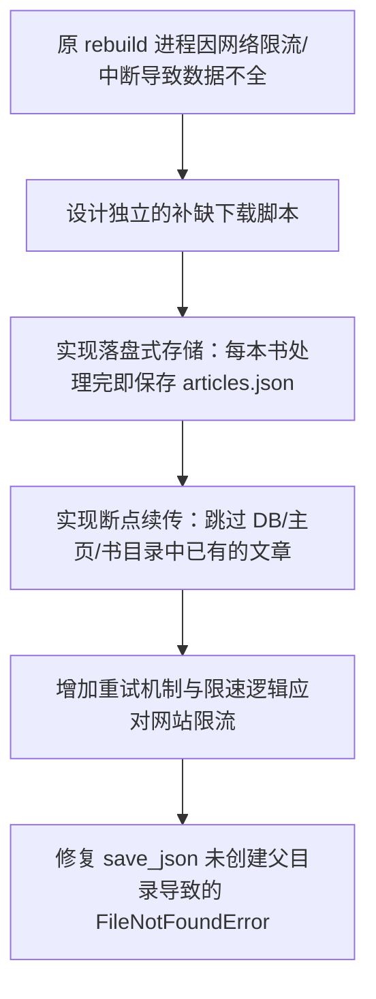

## 任务描述
开发 fetch_missing.py 脚本，用于断点续传式下载缺失的文章正文。

## 执行过程

```mermaid
graph TD
    A[原 rebuild 进程因网络限流/中断导致数据不全] --> B[设计独立的补缺下载脚本]
    B --> C[实现落盘式存储：每本书处理完即保存 articles.json]
    C --> D[实现断点续传：跳过 DB/主页/书目录中已有的文章]
    D --> E[增加重试机制与限速逻辑应对网站限流]
    E --> F[修复 save_json 未创建父目录导致的 FileNotFoundError]
```

## 任务总结
创建了 fetch_missing.py，支持从 tocs.json 出发，智能判断文章是否缺失，并带间隔下载。脚本具备断点续传能力，即使进程中断也可安全重跑，解决了网络不稳定导致的数据完整性问题。
