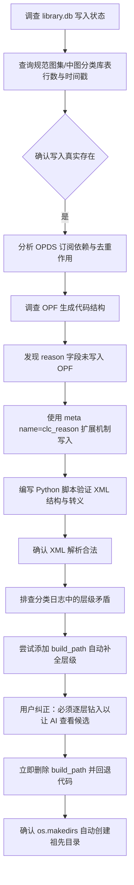

## 任务描述
调查图书馆数据库 (library.db) 的真实写入情况与必要性，并在 metadata.opf 中增加 AI 分类依据字段，同时修正分类流程中的层级钻入逻辑。

## 执行过程

## 任务总结
1. **DB 调查**：确认 library.db 真实写入（规范图集库 2 行，最新 15:47:57），用于 OPDS 订阅及防重复入库，非必需但无害。
2. **OPF 扩展**：在 organizer.py 中通过 `<meta name="clc_reason" content="..."/>` 写入 AI 分类理由，利用 OPF 2.0 标准扩展机制，经 XML 解析器验证结构合法且不破坏兼容性。
3. **流程修正**：确认归档时 `os.makedirs` 自动创建完整祖先路径；坚决保留“逐层钻入”的分类逻辑，删除了试图自动补全层级的 `build_path` 函数，确保 AI 每层都能看到官方候选类目。
