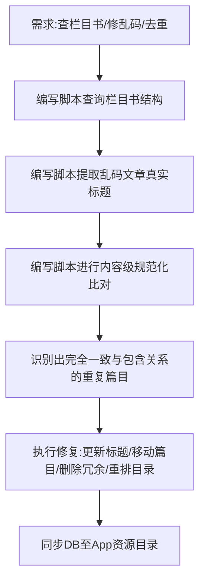

## 任务描述
清理恩格斯拾遗汇编(2118)及关联书籍中的乱码标题和内容重复，并回答栏目书内容查询。

## 执行过程

## 任务总结
1. **栏目书查询**：查清了《附录》《其它》《未分段》各作者的文章构成。
2. **乱码修复**：通过正则清洗标题中的HTML标签和特殊符号，从正文第一行提取正确标题（如'各别的劳动部门'）。
3. **去重合并**：采用规范化文本（去空格、标点、HTML）进行精确匹配。将2118中与1416完全一致的篇目删除；将缺失章节（导言/大城市/竞争）从2118移入1416；删除错挂的重复篇目12345。最终1416补全为20篇，2118精简为6篇独有内容。
