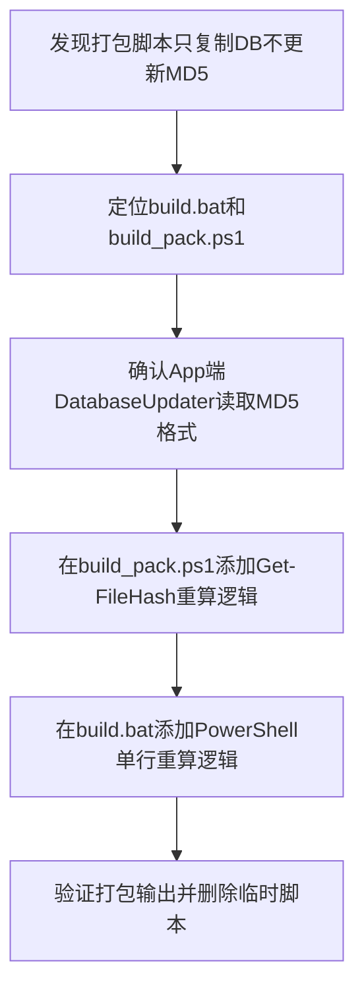

## 任务描述
修复打包脚本在DB同步后不重算MD5导致已装版本无法更新语料库的问题。

## 执行过程

```mermaid
graph TD
    A[发现打包脚本只复制DB不更新MD5] --> B[定位build.bat和build_pack.ps1]
    B --> C[确认App端DatabaseUpdater读取MD5格式]
    C --> D[在build_pack.ps1添加Get-FileHash重算逻辑]
    D --> E[在build.bat添加PowerShell单行重算逻辑]
    E --> F[验证打包输出并删除临时脚本]
```

## 任务总结
成功在build_pack.ps1和build.bat中内嵌MD5重算逻辑，确保每次打包都更新quote.db.md5文件，解决用户无法获取新语料库的问题。
